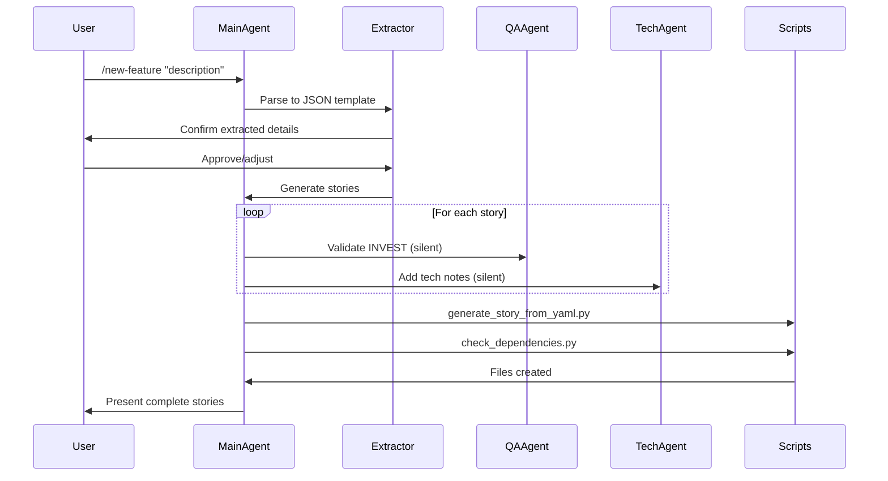

# User Story System Implementation Guide

## System Overview

A Claude Code-based workflow for generating, validating, and managing user stories for Levero development. Uses interactive extraction, sub-agent automation, and Python/shell scripts.

## Directory Structure

```
/user-story-system/
├── prompts/
│   ├── main-orchestrator.md
│   └── sub-agents/
│       ├── qa-validator.md
│       └── technical-annotator.md
├── skills/
│   ├── templates/
│   │   ├── story-template.yaml
│   │   ├── story-template.md
│   │   └── epic-template.yaml
│   ├── scripts/
│   │   ├── generate_story_from_yaml.py
│   │   ├── validate_story_invest.py
│   │   ├── check_dependencies.py
│   │   └── batch_story_generator.py
│   ├── shell/
│   │   ├── create_story.sh
│   │   └── move_to_sprint.sh
│   └── SKILL.md
├── config/
│   ├── personas.yaml
│   ├── story-statuses.yaml
│   └── automation-config.yaml
├── stories/
│   ├── yaml-source/
│   ├── generated-docs/
│   └── backlog/
└── epics/
```

## Core Workflow



## 1. Main Orchestrator Prompt

**File:** `prompts/main-orchestrator.md`

```markdown
# User Story System for Levero

You help Matteo create and manage user stories using a structured workflow.

## Feature Extraction Template

When user provides feature description, extract to this JSON:

```json
{
  "feature_name": "",
  "business_objective": "",
  "target_personas": ["CEO consulting client", "Matteo consultant"],
  "user_jobs": [],
  "constraints": [],
  "success_metrics": [],
  "estimated_complexity": "small|medium|large"
}
```

**Process:**
1. Parse user input to template
2. Show extracted JSON for confirmation
3. Wait for user approval/adjustment
4. Generate stories based on approved extraction

## Commands

### /new-feature [description]
- Extract feature details to JSON template
- Confirm with user
- Decompose into 2-8 user stories
- Create epic if complexity = large
- For each story:
  - Generate YAML (use templates/story-template.yaml)
  - Invoke qa-validator sub-agent (silent)
  - Invoke technical-annotator sub-agent (silent)
- Run scripts/generate_story_from_yaml.py
- Run scripts/check_dependencies.py
- Present: stories + dependency map + priorities

### /refine [story-ids | "backlog"]
- Load specified stories
- For each: invoke qa-validator sub-agent
- Present issues + suggested fixes
- On user approval: apply fixes, regenerate markdown
- Present: quality report

### /sprint [capacity-points]
- Load backlog (status: backlog, priority: high/medium)
- Check dependencies
- Fit stories to capacity
- Run shell/move_to_sprint.sh
- Present: sprint plan + story list

### /validate [story-id]
- Run scripts/validate_story_invest.py
- Run scripts/check_dependencies.py
- Present: validation report

## Story Generation Rules

### Story Structure (YAML)
```yaml
story_id: US-XXX
title: "User-centric action"
persona: "CEO consulting client"
as_a: "CEO consulting client"
i_want: "capability"
so_that: "business value"
acceptance_criteria:
  - given: "context"
    when: "action"
    then: "outcome"
metadata:
  epic: "EP-XXX"
  priority: high|medium|low
  story_points: 1-13
  status: backlog
```

### INVEST Quality
- **Independent**: Can be built separately
- **Negotiable**: Details flexible
- **Valuable**: Clear user benefit
- **Estimable**: Team can size it
- **Small**: Fits in one sprint
- **Testable**: Clear pass/fail

### Acceptance Criteria Format
Always use Given/When/Then:
- **Given** [precondition/context]
- **When** [user action]
- **Then** [expected outcome]

## Sub-Agent Invocation

Sub-agents run silently (no user interaction). Integrate results automatically.

**Available sub-agents:**
- `sub-agents/qa-validator.md` - INVEST validation
- `sub-agents/technical-annotator.md` - Implementation notes

## Personas (from config/personas.yaml)

```yaml
ceo_client:
  name: "CEO Consulting Client"
  role: "decision_maker"
  goals: ["Quick insights", "Track progress"]
  pain_points: ["Too much data", "Unclear actions"]

matteo_consultant:
  name: "Matteo (Consultant)"
  role: "service_provider"
  goals: ["Deliver efficiently", "Scale without manual work"]
```

## Example Output Format

After /new-feature command:

```
✓ Generated 3 stories for: Client Authentication

Epic: EP-001: User Access & Security

Stories:
━━━━━━━━━━━━━━━━━━━━━━━━━━━━━━━━━━━━
US-001: Google OAuth Login
Priority: High | Points: 5 | Status: Backlog

As a CEO consulting client,
I want to log in with Google OAuth,
So that I can access my dashboard securely.

AC: 3 criteria defined ✓
INVEST: All criteria met ✓
Tech notes: Added ✓
━━━━━━━━━━━━━━━━━━━━━━━━━━━━━━━━━━━━

[2 more stories...]

Dependencies:
US-001 blocks US-002 (Dashboard Access)

Files created:
- stories/yaml-source/US-001.yaml
- stories/generated-docs/US-001.md
- epics/EP-001.yaml
```
```

## 2. Sub-Agent: QA Validator

**File:** `prompts/sub-agents/qa-validator.md`

```markdown
# QA Validator Sub-Agent

Validate user story against INVEST criteria. Return structured assessment.

## Input
Story YAML object

## Checks

### Independent
- Can be developed without other stories?
- No tight coupling to others?

### Negotiable  
- Details flexible for discussion?
- Not over-specified?

### Valuable
- Clear user benefit stated?
- "So that" clause meaningful?

### Estimable
- Can team estimate effort?
- Scope clear enough?

### Small
- Completable in one sprint?
- Story points ≤ 13?

### Testable
- Acceptance criteria present?
- Pass/fail criteria clear?

## Output Format

```json
{
  "story_id": "US-XXX",
  "invest_score": {
    "independent": {"pass": true, "notes": ""},
    "negotiable": {"pass": true, "notes": ""},
    "valuable": {"pass": false, "notes": "So that clause too vague"},
    "estimable": {"pass": true, "notes": ""},
    "small": {"pass": true, "notes": ""},
    "testable": {"pass": true, "notes": ""}
  },
  "overall_pass": false,
  "recommended_fixes": [
    "Clarify business value in 'so that' clause",
    "Add specific metric or outcome"
  ]
}
```

## Rules
- Always validate all 6 criteria
- Be strict but constructive
- Provide actionable fix suggestions
- No user interaction (run silently)
```

## 3. Sub-Agent: Technical Annotator

**File:** `prompts/sub-agents/technical-annotator.md`

```markdown
# Technical Annotator Sub-Agent

Add technical implementation notes to user stories. Focus on Levero tech stack.

## Tech Stack Context
- Frontend: React, TypeScript, Tailwind
- Backend: Python (FastAPI), PostgreSQL
- Auth: Supabase Auth
- Deployment: Cloudflare Workers
- Automation: n8n

## Input
Story YAML with acceptance criteria

## Output
Add to story YAML:

```yaml
technical_notes:
  implementation_hints: []
  dependencies: []
  considerations: []
  estimated_effort: "X hours"
```

## Guidelines
- Be concise (2-4 bullet points)
- Flag technical risks
- Suggest libraries/tools when relevant
- Note integration points
- Estimate effort if obvious

## Example

Input story: "User views constraint matrix visualization"

Output:
```yaml
technical_notes:
  implementation_hints:
    - "Use Recharts for scatter plot (impact vs effort axes)"
    - "Store constraint data in PostgreSQL with jsonb column"
  dependencies:
    - "Requires assessment completion (US-005)"
    - "Need constraint scoring algorithm"
  considerations:
    - "Performance: limit to 50 constraints per view"
    - "Mobile: simplify to list view on small screens"
  estimated_effort: "8-12 hours"
```

## Rules
- Run silently (no user interaction)
- Only add value, don't state obvious
- Use Matteo's tech preferences
```

## 4. Story Template (YAML)

**File:** `skills/templates/story-template.yaml`

```yaml
story_id: US-XXX
title: ""
type: feature  # feature | enhancement | bug

persona: ""
as_a: ""
i_want: ""
so_that: ""

acceptance_criteria:
  - given: ""
    when: ""
    then: ""

metadata:
  epic: ""
  priority: medium  # high | medium | low
  story_points: null
  sprint: null
  status: backlog  # backlog | in_progress | review | done

dependencies:
  blocks: []
  blocked_by: []
  related: []

technical_notes:
  implementation_hints: []
  dependencies: []
  considerations: []
  estimated_effort: ""

created_at: ""
updated_at: ""
```

## 5. Python Scripts

### `scripts/generate_story_from_yaml.py`

```python
#!/usr/bin/env python3
"""Convert YAML story to Markdown documentation."""

import yaml
from pathlib import Path
from datetime import datetime

def generate_markdown(yaml_path: Path) -> str:
    with open(yaml_path) as f:
        story = yaml.safe_load(f)
    
    md = f"""# {story['story_id']}: {story['title']}

**Epic:** {story['metadata']['epic']} | **Priority:** {story['metadata']['priority']} | **Points:** {story['metadata'].get('story_points', 'TBD')}

## Story

As a **{story['as_a']}**,  
I want to **{story['i_want']}**,  
So that **{story['so_that']}**.

## Acceptance Criteria

"""
    
    for i, ac in enumerate(story['acceptance_criteria'], 1):
        md += f"{i}. **Given** {ac['given']}\n"
        md += f"   **When** {ac['when']}\n"
        md += f"   **Then** {ac['then']}\n\n"
    
    if story.get('technical_notes'):
        tn = story['technical_notes']
        md += "\n## Technical Notes\n\n"
        if tn.get('implementation_hints'):
            md += "**Implementation:**\n"
            for hint in tn['implementation_hints']:
                md += f"- {hint}\n"
        if tn.get('considerations'):
            md += "\n**Considerations:**\n"
            for con in tn['considerations']:
                md += f"- {con}\n"
        if tn.get('estimated_effort'):
            md += f"\n**Effort:** {tn['estimated_effort']}\n"
    
    if story.get('dependencies'):
        deps = story['dependencies']
        if any(deps.values()):
            md += "\n## Dependencies\n\n"
            if deps.get('blocks'):
                md += f"**Blocks:** {', '.join(deps['blocks'])}\n"
            if deps.get('blocked_by'):
                md += f"**Blocked by:** {', '.join(deps['blocked_by'])}\n"
    
    md += f"\n---\n*Generated: {datetime.now().strftime('%Y-%m-%d %H:%M')}*\n"
    
    return md

if __name__ == "__main__":
    import sys
    yaml_path = Path(sys.argv[1])
    md_content = generate_markdown(yaml_path)
    
    # Save to generated-docs with same filename
    output_path = Path("stories/generated-docs") / yaml_path.with_suffix('.md').name
    output_path.parent.mkdir(parents=True, exist_ok=True)
    output_path.write_text(md_content)
    
    print(f"✓ Generated: {output_path}")
```

### `scripts/validate_story_invest.py`

```python
#!/usr/bin/env python3
"""Validate story against INVEST criteria."""

import yaml
import sys
from pathlib import Path

def validate_invest(story: dict) -> dict:
    issues = []
    
    # Independent
    if story.get('dependencies', {}).get('blocked_by'):
        issues.append("⚠ Has blocking dependencies - may not be independent")
    
    # Valuable
    if not story.get('so_that') or len(story['so_that']) < 20:
        issues.append("✗ Value statement too short or missing")
    
    # Estimable
    if not story['metadata'].get('story_points'):
        issues.append("⚠ No story points estimated")
    
    # Small
    points = story['metadata'].get('story_points', 0)
    if points and points > 13:
        issues.append(f"✗ Too large ({points} points) - should be ≤13")
    
    # Testable
    if not story.get('acceptance_criteria') or len(story['acceptance_criteria']) < 1:
        issues.append("✗ No acceptance criteria defined")
    
    return {
        'story_id': story['story_id'],
        'valid': len(issues) == 0,
        'issues': issues
    }

if __name__ == "__main__":
    yaml_path = Path(sys.argv[1])
    with open(yaml_path) as f:
        story = yaml.safe_load(f)
    
    result = validate_invest(story)
    
    print(f"\n{result['story_id']}: {'✓ PASS' if result['valid'] else '✗ FAIL'}")
    if result['issues']:
        for issue in result['issues']:
            print(f"  {issue}")
    print()
```

### `scripts/check_dependencies.py`

```python
#!/usr/bin/env python3
"""Check for circular dependencies and generate dependency graph."""

import yaml
from pathlib import Path
from collections import defaultdict
import sys

def load_all_stories(stories_dir: Path) -> dict:
    stories = {}
    for yaml_file in stories_dir.glob("*.yaml"):
        with open(yaml_file) as f:
            story = yaml.safe_load(f)
            stories[story['story_id']] = story
    return stories

def find_circular_deps(stories: dict) -> list:
    def has_cycle(node, visited, rec_stack, graph):
        visited.add(node)
        rec_stack.add(node)
        
        for neighbor in graph.get(node, []):
            if neighbor not in visited:
                if has_cycle(neighbor, visited, rec_stack, graph):
                    return True
            elif neighbor in rec_stack:
                return True
        
        rec_stack.remove(node)
        return False
    
    # Build dependency graph
    graph = defaultdict(list)
    for story_id, story in stories.items():
        blocked_by = story.get('dependencies', {}).get('blocked_by', [])
        for dep in blocked_by:
            graph[story_id].append(dep)
    
    # Find cycles
    visited = set()
    cycles = []
    for node in graph:
        if node not in visited:
            if has_cycle(node, visited, set(), graph):
                cycles.append(node)
    
    return cycles

def generate_mermaid_graph(stories: dict) -> str:
    md = "```mermaid\ngraph TD\n"
    
    for story_id, story in stories.items():
        title = story['title'][:30]
        md += f'    {story_id}["{story_id}: {title}"]\n'
        
        blocks = story.get('dependencies', {}).get('blocks', [])
        for blocked_id in blocks:
            md += f'    {story_id} --> {blocked_id}\n'
    
    md += "```\n"
    return md

if __name__ == "__main__":
    stories_dir = Path("stories/yaml-source")
    stories = load_all_stories(stories_dir)
    
    circular = find_circular_deps(stories)
    
    if circular:
        print("✗ Circular dependencies found:")
        for story_id in circular:
            print(f"  - {story_id}")
        sys.exit(1)
    
    print("✓ No circular dependencies")
    print("\nDependency Graph:")
    print(generate_mermaid_graph(stories))
```

## 6. Configuration Files

### `config/personas.yaml`

```yaml
personas:
  ceo_client:
    name: "CEO Consulting Client"
    role: "decision_maker"
    goals:
      - "Quick insights from diagnostics"
      - "Track progress over time"
      - "Understand next actions"
    pain_points:
      - "Too much data"
      - "Unclear priorities"
      - "Manual report requests"
    
  matteo_consultant:
    name: "Matteo (Consultant)"
    role: "service_provider"
    goals:
      - "Deliver insights efficiently"
      - "Scale without manual work"
      - "Track client progress"
    pain_points:
      - "Manual report generation"
      - "Repeated similar analyses"
      - "Limited time per client"
```

### `config/automation-config.yaml`

```yaml
automation:
  story_creation:
    auto_generate_id: true
    auto_markdown: true
    auto_validate: true
  
  git:
    auto_commit: false
    commit_message_template: "feat: Add {story_id} - {title}"
  
  naming:
    story_id_prefix: "US"
    epic_id_prefix: "EP"
    id_padding: 3  # US-001, US-002, etc.
  
  defaults:
    priority: "medium"
    status: "backlog"
```

## 7. Shell Scripts

### `skills/shell/create_story.sh`

```bash
#!/bin/bash
# Create new story with proper structure

STORY_TITLE="$1"
EPIC_ID="$2"

# Generate next story ID
LAST_ID=$(ls stories/yaml-source/US-*.yaml 2>/dev/null | tail -1 | grep -oP 'US-\K\d+' || echo "0")
NEXT_ID=$(printf "US-%03d" $((10#$LAST_ID + 1)))

# Create from template
cp skills/templates/story-template.yaml "stories/yaml-source/${NEXT_ID}.yaml"

# Update with provided info
sed -i "s/story_id: US-XXX/story_id: ${NEXT_ID}/" "stories/yaml-source/${NEXT_ID}.yaml"
sed -i "s/title: \"\"/title: \"${STORY_TITLE}\"/" "stories/yaml-source/${NEXT_ID}.yaml"
sed -i "s/epic: \"\"/epic: \"${EPIC_ID}\"/" "stories/yaml-source/${NEXT_ID}.yaml"

echo "✓ Created: stories/yaml-source/${NEXT_ID}.yaml"
echo "Edit the file to complete the story details"
```

### `skills/shell/move_to_sprint.sh`

```bash
#!/bin/bash
# Move stories to current sprint

SPRINT_NAME="$1"
shift
STORY_IDS="$@"

for STORY_ID in $STORY_IDS; do
    YAML_FILE="stories/yaml-source/${STORY_ID}.yaml"
    
    if [ -f "$YAML_FILE" ]; then
        # Update sprint and status
        sed -i "s/sprint: null/sprint: ${SPRINT_NAME}/" "$YAML_FILE"
        sed -i "s/status: backlog/status: in_progress/" "$YAML_FILE"
        
        # Regenerate markdown
        python3 scripts/generate_story_from_yaml.py "$YAML_FILE"
        
        echo "✓ Moved ${STORY_ID} to sprint ${SPRINT_NAME}"
    else
        echo "✗ Story not found: ${STORY_ID}"
    fi
done
```

## 8. Implementation Steps

1. **Setup directory structure:**
```bash
mkdir -p user-story-system/{prompts/sub-agents,skills/{templates,scripts,shell},config,stories/{yaml-source,generated-docs,backlog},epics}
```

2. **Create files in order:**
   - `config/personas.yaml`
   - `config/automation-config.yaml`
   - `skills/templates/story-template.yaml`
   - `prompts/sub-agents/qa-validator.md`
   - `prompts/sub-agents/technical-annotator.md`
   - `prompts/main-orchestrator.md`
   - All Python scripts in `skills/scripts/`
   - All shell scripts in `skills/shell/`

3. **Make scripts executable:**
```bash
chmod +x skills/scripts/*.py
chmod +x skills/shell/*.sh
```

4. **Test with simple story:**
```bash
./skills/shell/create_story.sh "Test Story" "EP-001"
python3 skills/scripts/validate_story_invest.py stories/yaml-source/US-001.yaml
```

5. **Configure Claude Code to load main orchestrator prompt**

## 9. Usage Examples

### Creating Stories
```
/new-feature "Dashboard showing scalability score with filtering"

[Claude extracts to JSON, you confirm]

✓ Generated 2 stories + 1 epic
Files ready in stories/yaml-source/
```

### Refining Backlog
```
/refine backlog

Checking 12 stories...
Found 3 issues:
- US-005: Value statement unclear
- US-007: Too large (21 points)
- US-009: Missing acceptance criteria

Apply suggested fixes? [y/n]
```

### Sprint Planning
```
/sprint 40

Available capacity: 40 points
Recommended stories (38 points total):
- US-001 (5 pts) - High priority
- US-003 (8 pts) - High priority
- US-004 (13 pts) - Medium priority
- US-007 (12 pts) - Medium priority

Move these to sprint 2025-Q1-S1? [y/n]
```

## Key Benefits

- **Single prompt entry:** One file to maintain
- **Interactive extraction:** You control input quality
- **Silent automation:** Sub-agents work in background
- **Script integration:** Python handles file operations
- **Version controlled:** All YAML/MD in git
- **Scalable:** Works solo, scales to team