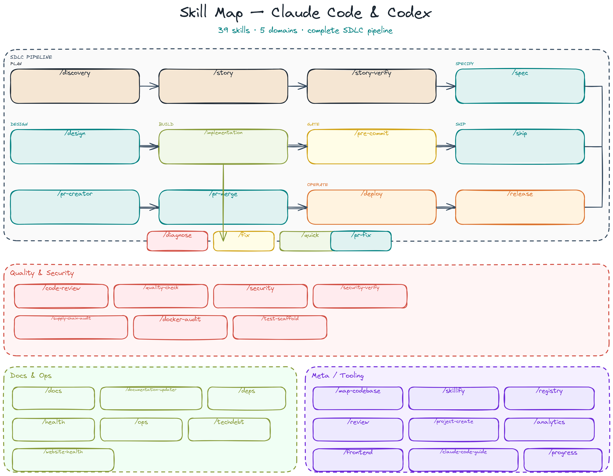
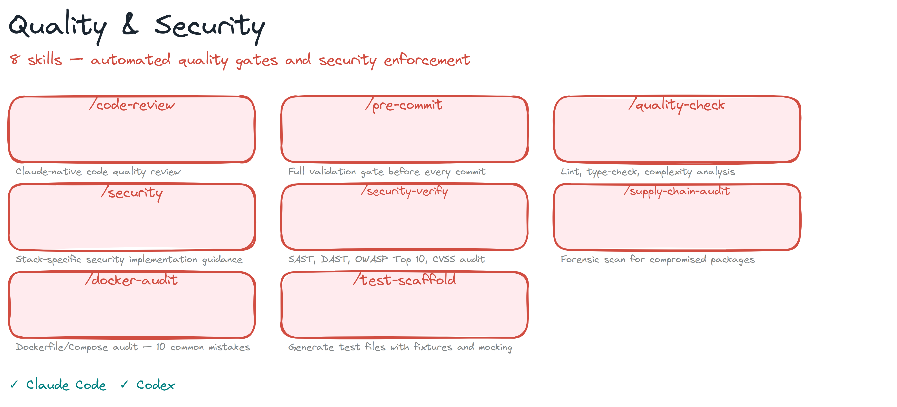
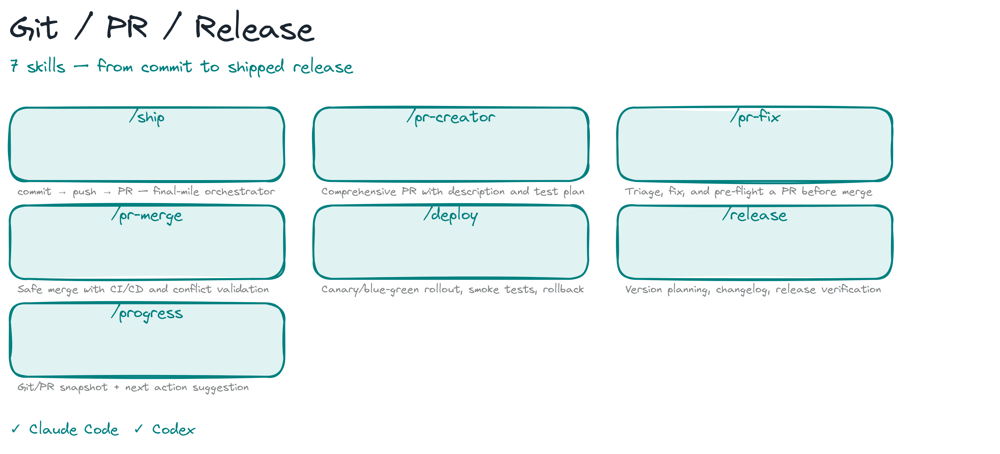
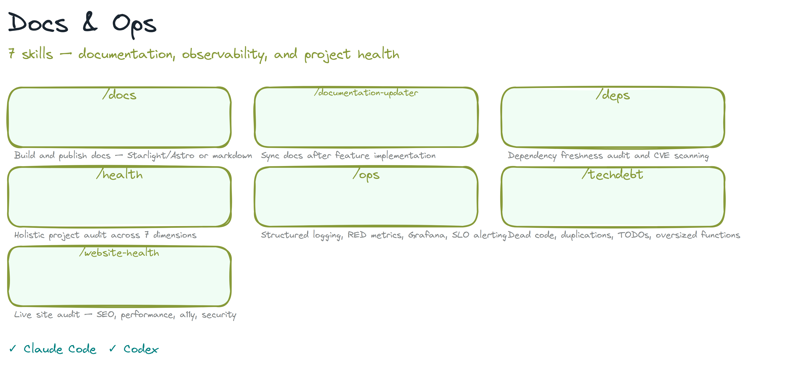
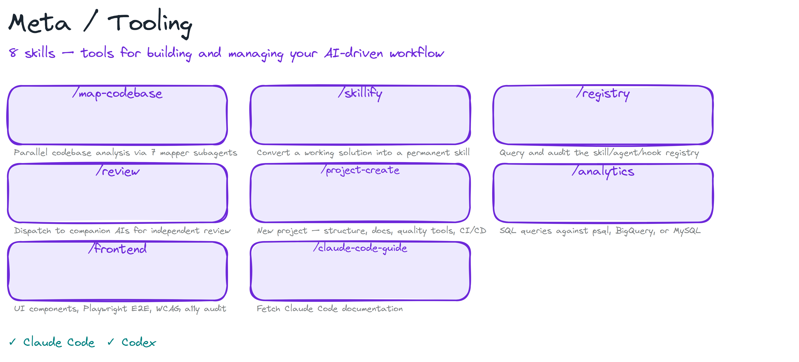

# Skill Catalog

39 skills — all battle-tested in both **Claude Code** and **Codex**.

`CC` = Claude Code · `CX` = Codex

## SDLC Pipeline

| Skill | Runtime | Trigger | Description |
|-------|---------|---------|-------------|
| `/discovery` | `CC` `CX` | "is this worth building", "validate this idea" | Phase 0 gate — problem framing, competitive analysis, feasibility, go/no-go |
| `/story` | `CC` `CX` | "write user stories", "break this into stories", "plan the sprint" | Feature idea → INVEST-compliant stories, epics, PRPs, sprint plans |
| `/story-verify` | `CC` `CX` | "validate the stories", "INVEST check", "are these stories ready" | INVEST scoring, story-to-test coverage, development readiness |
| `/spec` | `CC` `CX` | "write a spec", "spec before coding" | Durable feature spec before touching code. Pipelines into `/implementation` |
| `/design` | `CC` `CX` | "design the architecture", "design the API", "data model" | Component architecture, REST API contracts, Pydantic schemas |
| `/implementation` | `CC` `CX` | "implement this", "build it" | Spec-driven implementation — TDD waves, map patching, review |
| `/fix` | `CC` `CX` | "fix this bug", "fix issue #N" | Bug fix with minimal ceremony. Optional GitHub issue linkage |
| `/quick` | `CC` `CX` | "quick fix", "small change" | Zero-ceremony atomic task for tiny fixes (minutes, not hours) |
| `/diagnose` | `CC` `CX` | "investigate this bug", "unknown root cause" | Root cause investigation via subagent + companion solver |

## Quality & Security

| Skill | Runtime | Trigger | Description |
|-------|---------|---------|-------------|
| `/code-review` | `CC` `CX` | "review this code", "code review", "is this well-written" | Claude-native code quality review — no external AI |
| `/pre-commit` | `CC` `CX` | "validate before commit", "ready to commit", "run all checks" | Full gate: quality, tests, coverage, security scan, companion review |
| `/quality-check` | `CC` `CX` | "lint", "type-check", "quality check", "run the linters" | Multi-language formatting, linting, type-checking, complexity analysis |
| `/security` | `CC` `CX` | "how do I secure this", "security best practices", "is this secure" | Stack-specific security implementation guidance |
| `/security-verify` | `CC` `CX` | "security scan", "OWASP check", "scan for vulnerabilities" | SAST, DAST, OWASP Top 10, CVSS, adversarial audit |
| `/supply-chain-audit` | `CC` `CX` | "supply chain audit", "check for compromised packages" | Forensic scan for npm/PyPI supply-chain compromise |
| `/docker-audit` | `CC` `CX` | "audit my Dockerfile", "Docker best practices", "is my container secure" | Dockerfile and Compose audit against 10 common mistakes |
| `/test-scaffold` | `CC` `CX` | "scaffold tests", "generate test file", "write test boilerplate" | Unit test files with structure, fixtures, mocking (pytest / Jest) |

## Git / PR / Release

| Skill | Runtime | Trigger | Description |
|-------|---------|---------|-------------|
| `/ship` | `CC` `CX` | "ship it", "commit and push" | Final-mile orchestrator — commit → push → PR creation |
| `/pr-creator` | `CC` `CX` | "create a PR", "open a pull request" | Comprehensive PR with description, test plan, proper git workflow |
| `/pr-fix` | `CC` `CX` | "fix this PR", "triage the PR" | Triage, fix, and pre-flight a PR before merge |
| `/pr-merge` | `CC` `CX` | "merge the PR", "is this ready to merge" | Safe merge with CI/CD, review, conflict validation |
| `/release` | `CC` `CX` | "cut a release", "bump the version", "generate changelog" | Version planning, changelog generation, release verification |
| `/deploy` | `CC` `CX` | "deploy", "roll out", "canary", "feature flag" | Post-merge deployment — canary/blue-green, smoke tests, rollback |
| `/progress` | `CC` `CX` | "where was I", "what's next", "progress" | Situational awareness — fresh git/PR snapshot + next action suggestion |

## Docs & Ops

| Skill | Runtime | Trigger | Description |
|-------|---------|---------|-------------|
| `/docs` | `CC` `CX` | "write docs", "documentation site", "user guide" | Build and publish project docs — Starlight/Astro or markdown |
| `/documentation-updater` | `CC` `CX` | "update the docs", "sync docs after feature" | Update implementation docs, user guides, API docs, architecture diagrams |
| `/deps` | `CC` `CX` | "outdated dependencies", "dependency audit", "should I upgrade" | Dependency freshness audit, CVE scanning, PASS/WARN/FAIL gate |
| `/health` | `CC` `CX` | "project health", "audit the project", "health check" | Holistic audit across endpoints, versions, docs, security, quality, CI |
| `/ops` | `CC` `CX` | "add logging", "metrics", "dashboard", "alerting", "observability" | Structured logging, RED metrics, Prometheus, Grafana, SLO alerting |
| `/techdebt` | `CC` `CX` | "find tech debt", "dead code", "duplicated code", "code hygiene" | Dead code, duplications, TODOs, oversized functions |
| `/website-health` | `CC` `CX` | "audit my website", "site health", "check SEO" | Live website audit — SEO, performance, links, privacy, a11y, security |

## Meta / Tooling

| Skill | Runtime | Trigger | Description |
|-------|---------|---------|-------------|
| `/map-codebase` | `CC` `CX` | "map the codebase", "understand this repo" | Parallel codebase analysis via 7 mapper subagents |
| `/skillify` | `CC` `CX` | "make this a skill", "convert this to a skill" | Convert a working solution into a permanent, tested, registered skill |
| `/registry` | `CC` `CX` | "list skills", "component registry", "what skills exist" | Query, update, and audit the skill/agent/hook registry |
| `/review` | `CC` `CX` | "get a second opinion", "companion review", "review my changes" | Dispatch to external companion AIs (Codex, Gemini, Claude) |
| `/project-create` | `CC` `CX` | "create a new project", "initialize a project", "bootstrap a project" | New project with full setup — repo structure, docs, quality tools, CI/CD |
| `/analytics` | `CC` `CX` | "query the database", "SQL", "show me data from" | SQL queries against psql, BigQuery, or MySQL from terminal |
| `/frontend` | `CC` `CX` | "build a component", "E2E test", "accessibility audit", "a11y" | UI design, components, Playwright E2E, WCAG a11y, visual review |
| `/claude-code-guide` | `CC` | "how do I use Claude Code", "Claude Code docs" | Fetch Claude Code documentation and help with configuration |
