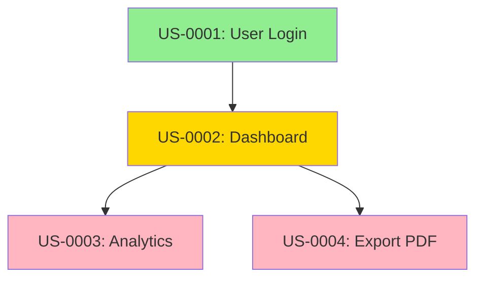

# Analyze Story Dependencies

Analyze story dependencies, detect circular dependencies, and generate dependency graphs.

## Usage

```
/user-story-deps
/user-story-deps <story-id>
/user-story-deps --diagram
```

## Examples

```
/user-story-deps
/user-story-deps US-0001
/user-story-deps --diagram
/user-story-deps --output deps.mmd
```

## What it does

1. **Load Stories** - Loads all story files or specific story
2. **Build Graph** - Creates dependency graph
3. **Detect Issues** - Finds circular dependencies and long chains
4. **Identify Independents** - Finds stories ready to start
5. **Find Bottlenecks** - Identifies stories blocking many others
6. **Generate Diagram** - Creates Mermaid visualization
7. **Provide Report** - Presents analysis with recommendations

## Result

- Dependency analysis report
- Circular dependency detection
- Blocking chain identification
- Independent story list
- Bottleneck identification
- Mermaid diagram (optional)

---

Activate the **dependency-analyzer** skill to analyze story dependencies.

Use the `dependency-analyzer` skill located in `.claude/skills/dependency-analyzer/SKILL.md`.

## Parameters

- **story-id** (optional): Analyze dependencies for specific story
- **--diagram**: Generate Mermaid dependency diagram
- **--output <filename>**: Save diagram to file (default: deps.mmd)

## Dependency Types

### Blocks
Stories that this story prevents from starting:
```yaml
dependencies:
  blocks: ["US-0002", "US-0003"]
```

### Blocked By
Stories that must be completed before this story can start:
```yaml
dependencies:
  blocked_by: ["US-0001"]
```

### Related To
Related stories that don't have blocking relationship:
```yaml
dependencies:
  related_to: ["US-0005"]
```

## Analysis Features

### 1. Circular Dependency Detection
Finds deadlock situations:
```
US-0001 blocks US-0002
US-0002 blocks US-0003
US-0003 blocks US-0001  ← Circular!
```

### 2. Long Blocking Chains
Identifies long sequences:
```
US-0001 → US-0002 → US-0003 → US-0004 → US-0005
(Chain length: 5)
```

### 3. Independent Stories
Stories with no dependencies - ready to start immediately

### 4. Bottleneck Stories
Stories that block many others - critical path items

### 5. Orphaned Stories
Stories that are blocked but their dependencies don't exist

## Dependency Graph Visualization

Generates Mermaid diagram:



**Colors:**
- 🟢 Green: Independent (no blockers)
- 🟡 Yellow: Has dependencies but ready
- 🔴 Red: Blocked or circular dependency

## Workflow

The skill will:
1. Load all story YAML files from `stories/yaml-source/`
2. Extract dependency information
3. Build dependency graph using NetworkX
4. Detect circular dependencies
5. Find long blocking chains (>3 stories)
6. Identify independent stories (no blockers)
7. Identify bottleneck stories (blocks many)
8. Check for orphaned dependencies
9. Generate Mermaid diagram (if requested)
10. Present comprehensive analysis report
11. Provide optimization suggestions

## Analysis Report Includes

- **Total Stories**: Count of all stories analyzed
- **Independent**: Stories ready to start (0 blockers)
- **Blocked**: Stories waiting for dependencies
- **Circular Dependencies**: Deadlock situations
- **Long Chains**: Chains longer than recommended
- **Bottlenecks**: Stories blocking >3 others
- **Orphans**: References to non-existent stories

## Optimization Suggestions

The skill provides recommendations:
- Break circular dependencies
- Split long chains
- Reduce bottlenecks
- Fix orphaned references
- Reorder priorities based on dependencies

## File References

- Skill: `.claude/skills/dependency-analyzer/SKILL.md`
- Script: `.claude/skills/dependency-analyzer/scripts/check_dependencies.py`
- Stories: `stories/yaml-source/US-*.yaml`
- Config: `.claude/skills/user-story-generator/config/automation-config.yaml`

## Use Cases

### Before Sprint Planning
Check dependencies to ensure you can start stories:
```
/user-story-deps
```

### For Specific Story
See what blocks or is blocked by a story:
```
/user-story-deps US-0001
```

### Generate Visual Map
Create diagram for team communication:
```
/user-story-deps --diagram --output sprint-deps.mmd
```

## Related Commands

- `/user-story-sprint` - Plan sprint (uses dependency analysis)
- `/user-story-new` - Create stories (sets dependencies)
- `/user-story-refine` - Validate stories (checks dependencies)
